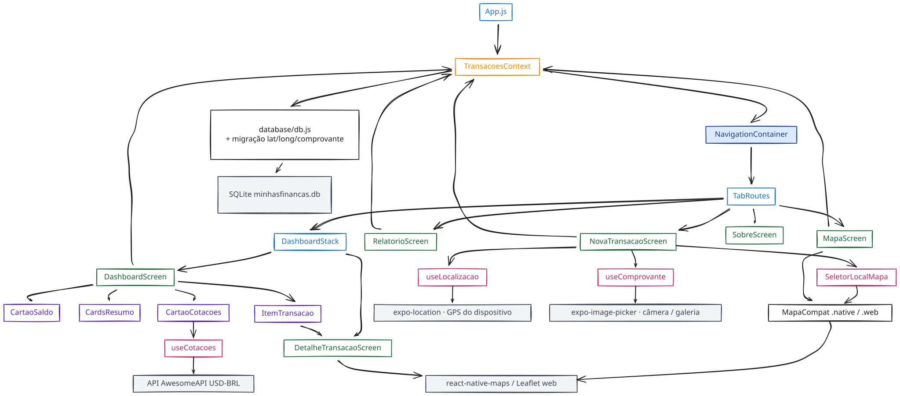

# Minhas Finanças

App de **controle financeiro pessoal** feito em React Native + Expo, desenvolvido aula a aula no **Módulo 06 — Mobile** do Curso de Capacitação em Desenvolvimento Full Stack da **ITEAM** (Prof. Marcelo Matos).

Registra receitas e despesas, calcula o saldo em tempo real, guarda tudo localmente no dispositivo, e — a partir da Aula 06 — sabe **onde** cada transação aconteceu (GPS + mapa) e **com o quê** (foto do comprovante). Roda em **Android, iOS e Web** com o mesmo código.

> Versão atual: **`1.5.0`** (Aula 06). A linha do tempo completa de versões está em [`RELEASE.md`](./RELEASE.md).

---

## Arquitetura



O app é organizado em camadas bem separadas:

| Camada | Pasta | Responsabilidade |
|--------|-------|------------------|
| **Entrada** | `App.js`, `index.js` | Monta os providers (`SafeAreaProvider` → `PrimeiroAcessoProvider` → `TransacoesProvider`) e o `NavigationContainer` |
| **Navegação** | `routes/` | `TabRoutes` (5 abas) → `DashboardStack` (Dashboard + Detalhe); `DrawerRoutes` disponível |
| **Telas** | `screens/` | Cada tela é um arquivo: Dashboard, Nova Transação, Relatório, Mapa, Sobre, Detalhe e Boas-Vindas |
| **Componentes** | `components/` | UI reutilizável: cartão de saldo, cards de resumo, item de transação, cartão de cotações, seletor de local, camada de mapa |
| **Estado** | `context/` | `TransacoesContext` (CRUD + saldo) e `PrimeiroAcessoContext` (onboarding) via Context API |
| **Hooks** | `hooks/` | `useCotacoes` (API de câmbio), `useLocalizacao` (GPS), `useComprovante` (câmera/galeria) |
| **Persistência** | `database/db.js` | SQLite (`expo-sqlite`) com migração automática de schema |
| **Tema** | `theme.js` | Paleta de cores, espaçamentos e raios de borda compartilhados |
| **Testes** | `tests/` | E2E com Jest + Puppeteer contra o Expo Web ([detalhes](./tests/README.md)) |

> O diagrama acima é editável em [Excalidraw](https://excalidraw.com/) (arquivo `grafico_projeto.excalidraw.svg`). Há também uma versão Mermaid clicável em [`mermaid.txt`](./mermaid.txt).

### Fluxo de dados

```
NovaTransacaoScreen ──┐
DetalheTransacaoScreen├─► useTransacoes() ─► TransacoesContext ─► database/db.js ─► SQLite (minhasfinancas.db)
DashboardScreen ──────┘                            │
RelatorioScreen ───────────────────────────────────┘  (deriva saldo/receitas/despesas do estado)

CartaoCotacoes ─► useCotacoes() ─► API de câmbio (USD-BRL / EUR-BRL)
NovaTransacaoScreen ─► useLocalizacao() ─► expo-location (GPS)
NovaTransacaoScreen ─► useComprovante() ─► expo-image-picker (câmera / galeria)
MapaScreen / SeletorLocalMapa ─► MapaCompat ─► react-native-maps (nativo) | react-leaflet + OpenStreetMap (web)
```

---

## Funcionalidades

- **Lançamento de transações** — descrição, valor, tipo (receita/despesa), categoria e data
- **Saldo em tempo real** — receitas, despesas e saldo recalculados a cada lançamento (`receitas − despesas`)
- **Lista de transações** — ordenadas da mais recente para a mais antiga; toque abre o detalhe, toque longo exclui
- **Tela de detalhe** — todos os dados da transação, local (quando há coordenadas) e foto do comprovante; botão "Excluir" com confirmação
- **Relatório do mês** — barra proporcional receitas × despesas, legenda com valores e saldo do período
- **Cotações de moedas** — dólar e euro no Dashboard, via API pública (`useCotacoes`)
- **Geolocalização da transação** — botão "Minha localização" usa o GPS do aparelho
- **Escolha manual no mapa** — modal `SeletorLocalMapa` onde o usuário toca para marcar o ponto
- **Tela "Mapa"** — todas as transações com coordenadas plotadas; pino verde para receita, vermelho para despesa, e `Callout` com descrição/valor/data
- **Comprovante fotográfico** — "Tirar foto" (câmera) ou "Da galeria" (`expo-image-picker`), com preview e remoção
- **Onboarding de primeiro acesso** — tela de boas-vindas exibida só uma vez (flag em `AsyncStorage`)
- **Persistência local com SQLite** — dados sobrevivem a fechar/reabrir o app, com **migração automática** de bancos de versões anteriores (`PRAGMA table_info` + `ALTER TABLE`)
- **Cross-platform de verdade** — Android, iOS e Web; a camada `MapaCompat.native.js` / `MapaCompat.web.js` esconde a diferença entre `react-native-maps` e `react-leaflet`
- **Testes E2E** — roteiros das aulas executados automaticamente no Expo Web

### Telas

| Tela | Aba | O que faz |
|------|-----|-----------|
| `BoasVindasScreen` | — | Onboarding exibido apenas no primeiro acesso |
| `DashboardScreen` | Dashboard | Cartão de saldo, cards de resumo, cotações e lista de transações |
| `DetalheTransacaoScreen` | (stack do Dashboard) | Detalhes da transação, local, comprovante e exclusão |
| `NovaTransacaoScreen` | Nova Transação | Formulário com seções de localização (GPS / mapa) e comprovante (câmera / galeria) |
| `RelatorioScreen` | Relatório | Barra proporcional receitas × despesas e saldo do mês |
| `MapaScreen` | Mapa | Mapa com pinos de todas as transações geolocalizadas |
| `SobreScreen` | Sobre | Informações do app, versão e stack |

---

## Stack tecnológica

- **Expo SDK** `~54.0.34` · **React** `19.1.0` · **React Native** `0.81.5` (New Architecture habilitada)
- **React Navigation `7.x`** — Native + Bottom Tabs + Native Stack + Drawer
- **expo-sqlite** `~16.0.10` — banco local de transações (no Web roda via WebAssembly + IndexedDB)
- **@react-native-async-storage/async-storage** `2.2.0` — flag de primeiro acesso
- **expo-location** `~19.0.8` — acesso ao GPS
- **react-native-maps** `1.20.1` — mapa nativo no Android/iOS
- **leaflet** `^1.9.4` + **react-leaflet** `^5.0.0` — mapa no Expo Web (tiles do OpenStreetMap, sem chave de API)
- **expo-image-picker** `~17.0.11` — câmera e galeria
- **Jest + Puppeteer** — testes E2E no Expo Web
- **EAS Build** — compilação na nuvem e publicação nas lojas

Permissões declaradas no [`app.json`](./app.json): localização (fine/coarse), câmera e microfone.

---

## Como rodar

Pré-requisitos: Node.js LTS e o app **Expo Go** no celular (ou um emulador Android/iOS).

```bash
# 1. Instalar dependências
npm install

# 2. Iniciar o bundler
npx expo start
#   pressione  a  → abre no Android
#   pressione  i  → abre no iOS
#   pressione  w  → abre no navegador (Expo Web, mapa via Leaflet/OpenStreetMap)

# Atalhos prontos:
npm run android   # expo start --android
npm run ios       # expo start --ios
npm run web       # expo start --web
```

Se o Expo Go não conectar (rede restritiva):

```bash
npx expo start --tunnel
# ou, via USB:
adb reverse tcp:8081 tcp:8081 && npx expo start
```

> No modo Web, dá para inspecionar o banco SQLite com `scripts/inspect-web-db.sh`.

---

## Testes

Testes E2E (Jest + Puppeteer) rodam contra o app no Expo Web. Em **dois terminais**:

```bash
# Terminal 1 — sobe o app
npx expo start --web

# Terminal 2 — roda os testes
cd tests && npm install && npm test
```

Variáveis úteis: `BASE_URL` (default `http://localhost:8081`) e `HEADLESS` (`false` mostra o Chromium). Relatórios HTML são gerados em `tests/reports/`. Detalhes, cobertura por aula e como simular falhas didáticas: [`tests/README.md`](./tests/README.md).

---

## Build e publicação (EAS)

Os perfis de build estão em [`eas.json`](./eas.json):

| Perfil | Uso | Saída |
|--------|-----|-------|
| `development` | Desenvolvimento com Dev Client | APK |
| `preview` | Distribuição interna a testadores | APK |
| `production` | Publicação nas lojas | AAB (Android) / IPA (iOS) |

```bash
npm install -g eas-cli
eas login
eas build --profile preview --platform android      # APK de teste
eas build --profile production --platform android   # AAB para a Google Play
eas submit --platform android                        # envia para a Play Console
```

Há também um workflow do EAS em `.eas/workflows/create-production-builds.yml`. O guia completo de configuração do `app.json`, ícones, build e publicação na Google Play / App Store está em [`STEPS.md`](./STEPS.md).

---

## Versionamento

Cada aula do módulo entrega uma nova versão (SemVer) — normalmente um incremento **MINOR**, por adicionar funcionalidades sem quebrar o que já existe:

| Versão | Aula | Mudança principal |
|--------|------|-------------------|
| `1.0.0` | 01 | Cabeçalho + contador interativo |
| `1.1.0` | 02 | Tela principal: saldo, cards de resumo e lista de transações |
| `1.2.0` | 03 | Navegação por Bottom Tabs + Stack, 6 telas e onboarding |
| `1.3.0` | 04 | Context API + AsyncStorage, cotações, Drawer e testes E2E |
| `1.4.0` | 05 | Persistência com SQLite + onboarding persistido; suporte ao Expo Web |
| `1.5.0` | 06 | Geolocalização, mapas cross-platform (RN-Maps + Leaflet) e câmera/comprovante |
| `1.6.0` | 07 | Publicação e deploy (EAS Build, lojas, OTA updates) |

Detalhes de cada release, regras de SemVer e o passo a passo para publicar no GitHub: [`RELEASE.md`](./RELEASE.md).

---

## Documentação do repositório

- [`STEPS.md`](./STEPS.md) — tutorial passo a passo das aulas
- [`RELEASE.md`](./RELEASE.md) — versionamento semântico e notas de release
- [`tests/README.md`](./tests/README.md) — testes E2E: como rodar, cobertura e simulação de falhas
- [`mermaid.txt`](./mermaid.txt) — diagrama de arquitetura em Mermaid (com links para os arquivos)
- [`grafico_projeto.excalidraw.svg`](./grafico_projeto.excalidraw.svg) — diagrama de arquitetura em Excalidraw (a imagem no topo)

---

## Estrutura de pastas

```
minhas-financas/
├── App.js · index.js · app.json · eas.json · theme.js · metro.config.js
├── assets/                 ícones (Android/iOS/Web), splash e play store
├── components/             CardsResumo, CartaoSaldo, CartaoCotacoes, ItemTransacao,
│                           SeletorLocalMapa, MapaCompat.native.js, MapaCompat.web.js
├── context/                TransacoesContext, PrimeiroAcessoContext
├── database/               db.js (SQLite + migração)
├── hooks/                  useCotacoes, useLocalizacao, useComprovante
├── routes/                 TabRoutes, DashboardStack, DrawerRoutes
├── screens/                BoasVindas, Dashboard, DetalheTransacao, NovaTransacao,
│                           Relatorio, Mapa, Sobre
├── scripts/                inspect-web-db.sh
├── tests/                  suítes Jest + Puppeteer e relatórios HTML
├── STEPS.md · RELEASE.md
└── grafico_projeto.excalidraw.svg · mermaid.txt
```

